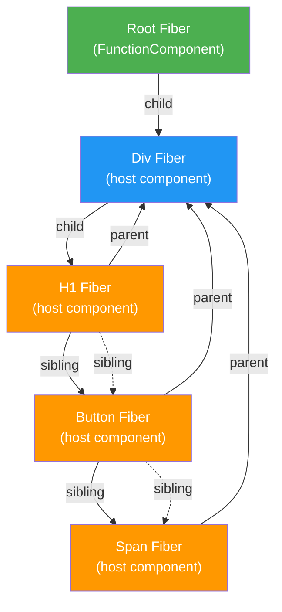
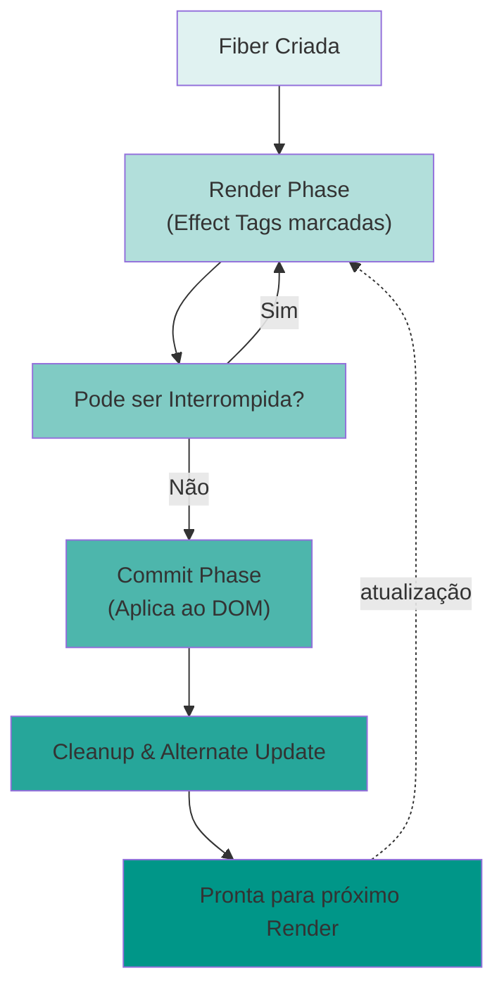

# Villax

**Sua própria implementação do React do zero!**

Este projeto é uma implementação completa e funcional do React, construída do zero.

## Features Implementadas

- ✅ JSX Support - Sintaxe JSX transformada via Babel
- ✅ Virtual DOM - Representação em memória da árvore de elementos
- ✅ Fiber Architecture - Arquitetura de fibras para trabalho incremental
- ✅ Concurrent Mode - Renderização interruptível usando `requestIdleCallback`
- ✅ Reconciliation - Algoritmo de diff para atualizar apenas o necessário
- ✅ Function Components - Suporte completo a componentes funcionais
- ✅ Hooks - Implementação do `useState` hook
- ✅ Event Handlers - Sistema de eventos otimizado

## Arquitetura

### Como funciona?

1. **createElement**: Transforma JSX em objetos JavaScript
2. **Render**: Inicia o processo de renderização criando a raiz da árvore de fibras
3. **Work Loop**: Executa trabalho incremental durante tempo ocioso do navegador
4. **Reconciliation**: Compara árvore atual com a anterior e determina mudanças
5. **Commit Phase**: Aplica todas as mudanças ao DOM de uma vez

### Fiber Tree

Cada elemento é representado como uma "fiber" que contém:
- `type`: Tipo do elemento (string ou função)
- `props`: Propriedades incluindo children
- `dom`: Referência ao nó DOM real
- `parent`, `child`, `sibling`: Links para navegação na árvore
- `alternate`: Link para a fiber da renderização anterior
- `effectTag`: Tipo de mudança (PLACEMENT, UPDATE, DELETION)

#### Estrutura Hierárquica



#### Fluxo de Renderização e Reconciliação

```mermaid
graph LR
    A["JSX/createElement<br/>(Virtual Element)"]
    B["Work Loop<br/>(requestIdleCallback)"]
    C["Reconciliation<br/>(Diff Algorithm)"]
    D["Effect Tags<br/>(PLACEMENT/UPDATE/DELETE)"]
    E["Commit Phase<br/>(Apply to DOM)"]
    F["Updated DOM"]
    
    A -->|input| B
    B -->|iterate fibers| C
    C -->|compare alternate| D
    D -->|batch operations| E
    E -->|mutations| F
    
    C -.->|next fiber| B
    
    style A fill:#E3F2FD,stroke:#1976D2
    style B fill:#F3E5F5,stroke:#7B1FA2
    style C fill:#FCE4EC,stroke:#C2185B
    style D fill:#FFF3E0,stroke:#E65100
    style E fill:#E8F5E9,stroke:#2E7D32
    style F fill:#C8E6C9,stroke:#1B5E20
```



#### Ciclo de Vida de uma Fiber



## Estrutura do Projeto

```
villax/
├── src/
│   ├── villax.js      # Core da biblioteca (React clone)
│   └── index.js       # Entry point
├── examples/
│   ├── counter.js     # Exemplo com useState
│   └── todo.js        # Todo App completo
├── dist/              # Build output
├── index.html         # HTML principal
└── DEVELOPMENT.md     # Guia de desenvolvimento
```

## Quick Start

```bash
# Instalar dependências
npm install

# Compilar o código
npm run build

# Abrir no navegador
open index.html

# Ou usar servidor local
npm start
```

## Scripts Disponíveis

```bash
npm run build       # Compilar projeto
npm run build:lib   # Compilar apenas a lib
npm run watch       # Modo watch
npm run dev         # Servidor HTTP (porta 8080) with watch mode
```

## Exemplo de Código

```jsx
/** @jsx Villax.createElement */
import Villax from './src/villax.js'

function Counter() {
    const [count, setCount] = Villax.useState(0)
    
    return (
        <div>
            <h1>Count: {count}</h1>
            <button onclick={() => setCount(c => c + 1)}>
                Increment
            </button>
        </div>
    )
}

const container = document.getElementById("root")
Villax.render(<Counter />, container)
```

Veja mais exemplos em [`examples/`](./examples).

## O que aprendi

Este projeto ensina conceitos fundamentais de como o React funciona internamente:

- **Reconciliation Algorithm**: Como o React decide o que atualizar
- **Fibers**: Estrutura de dados que permite trabalho interruptível
- **Hooks**: Como o estado é mantido entre renderizações
- **Rendering Pipeline**: As fases de render e commit
- **Event System**: Como eventos são gerenciados eficientemente

## Diferenças do React Real

Esta é uma versão didática. O React real inclui:
- Otimizações de performance
- Sistema de prioridades para updates
- Reutilização de objetos fiber
- Suporte a mais hooks (useEffect, useContext, etc)
- Reconciliação por keys
- Portais, Suspense, Error Boundaries
- E muito mais!

## Referências

- [Build Your Own React - Rodrigo Pomber](https://pomb.us/build-your-own-react/)
- [React Fiber Architecture](https://github.com/acdlite/react-fiber-architecture)
- [React Documentation](https://react.dev/)

## Para Estudar

Este projeto é perfeito para:
- Entender como o React funciona internamente
- Aprender sobre Virtual DOM e reconciliation
- Compreender a arquitetura de Fibers
- Ver como hooks funcionam "por baixo dos panos"
- Estudar algoritmos de diff

## Licença

MIT - Sinta-se livre para usar este projeto para aprender!

## Créditos

Baseado no excelente tutorial ["Build Your Own React"](https://pomb.us/build-your-own-react/) de [Rodrigo Pomber](https://twitter.com/pomber).

---

**Feito S2 para aprender como o React funciona internamente**

⭐ Se este projeto te ajudou a entender React, considere dar uma estrela!

> ⚠️ Status: **Em desenvolvimento ativo**. Estrutura, API e roadmap podem mudar sem aviso enquanto conceitos são explorados.
>
> Reimplementação educacional de conceitos centrais do React (Virtual DOM, reconciler, renderização incremental, hooks básicos) para fins de estudo e experimentação. Não pretende ser production-ready.

## Objetivos
- Entender como `createElement` (JSX-like) gera estruturas intermediárias (árvore de elementos).
- Construir um Virtual DOM simples e compará-lo com o DOM real.
- Implementar um algoritmo de reconciliação básico (diff por tipo + chaves simples posteriormente).
- Explorar um loop de renderização incremental inspirado em Fiber (versão minimalista).
- Criar uma API enxuta de "hooks" (ex: `useState`, `useEffect`) para compreender coordenação de estado e efeitos.
- Mapear limitações e apontar caminhos de evolução.

## Arquitetura (Visão Geral)
```
App (função) -> createElement() -> Virtual Node Tree -> Reconciler -> Patch DOM -> Commit Effects
```
Componentes funcionais retornam elementos (objetos). O reconciler calcula diferenças entre versão anterior e nova, gerando um conjunto mínimo de operações (criar, atualizar, remover nós). Em seguida, uma fase de "commit" aplica as mudanças ao DOM e dispara efeitos.

## Roadmap Detalhado
1. Renderização inicial (montagem completa sem diff).
2. Introduzir diff por tipo (elemento diferente => recria ramo).
3. Diff por props (atualizar apenas mudado).
4. Suporte a eventos (onClick, etc.).
5. Implementar `render` incremental (yield via `requestIdleCallback`).
6. Adicionar `useState` com fila simples de atualizações.
7. Adicionar `useEffect` com ciclo de cleanup.
8. Chaves em listas (`key`) e heurística de movimentação.
9. Simplificar erro boundaries (opcional / documentação sobre exceções).
10. Benchmark básico: comparar custo de atualizações diretas vs diff.

## Decisões de Design
- Manter objetos de elemento o mais próximos possível do formato React simplificado (`{ type, props }`).
- Separar nós de texto com `type: 'TEXT_ELEMENT'` para uniformizar reconciliação.
- Adiar otimizações (ex: subtree memoization) até ter casos reais.
- Priorizar clareza de código sobre performance.

## Limitações Conhecidas
- Sem suporte a Fragment, Portal, Suspense.
- Reconciler inicial ingênuo (complexidade potencialmente alta em árvores grandes).
- Hooks não serão completos (sem `useReducer`, `useContext`, etc.).
- Sem server-side rendering.

## Referências
- Documentação oficial do React (arquitetura Fiber, hooks).
- Artigos: "Didact" (mini React), posts sobre Virtual DOM e reconciler.
- Código aberto de versões anteriores do React para estudo conceitual.

## Licença
Este projeto está licenciado sob a **Licença MIT**.

Resumo não oficial:
- Uso, cópia, modificação, fusão, publicação e distribuição permitidos.
- É obrigatório manter o aviso de copyright e o texto da licença.
- Não há garantia; fornecido "no estado em que se encontra".

Consulte o arquivo `LICENSE` para o texto completo.

